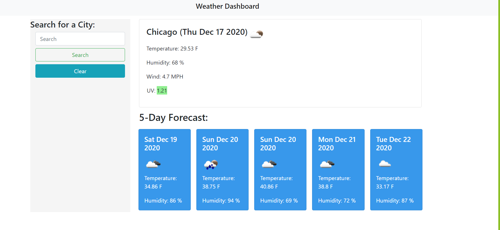

# Weather Dashboard

This repository houses the program of a _**weather dashboard**_ which was created with jQuery.  The program allows the user to see the current weather, and allows to see the forecast for the upcoming five days.

## Preview

Here is a screenshot of the program...

## Using the Scheduler

The _**weather dashboard**_ uses jQuery to dynamically create the website you see when loading up the program.  The program is complete with a search bar, a section for recent searches, and a section for current weather and forecast weather up to five days.  When a user searches for a city, the city is logged to the dom and to localStorage to persist when the page refreshes.  When clicking on a recent search, the weather will change dynamically.  You can also clear the recent searches which will also clear the localStorage.

The UV index also changes color dynamically according to the current uv index:
- Red for any index that has exceeded the uv index threshold
- Yellow for any index that is in the moderate uv index threshold
- Green for any index that is in the favorable uv index threshold

## Appreciation

I would like to thank you for visiting my repository and for checking out my program.  If you haven't already, feel free to visit my website at [Weather_Dashboard](https://davidesotomayor.github.io/weather-dashboard/)

### Sources:

Here are the sources that helped me create this program:

* [MDN Web Docs](https://developer.mozilla.org/en-US/)
* [jQuery](https://jquery.com/)
* [stack**overflow**](https://stackoverflow.com/)
* [w3schools](https://www.w3schools.com/)

### License:

Copyright &copy; David Sotomayor

Licensed under the [MIT](https://github.com/microsoft/vscode/blob/master/LICENSE.txt) license.